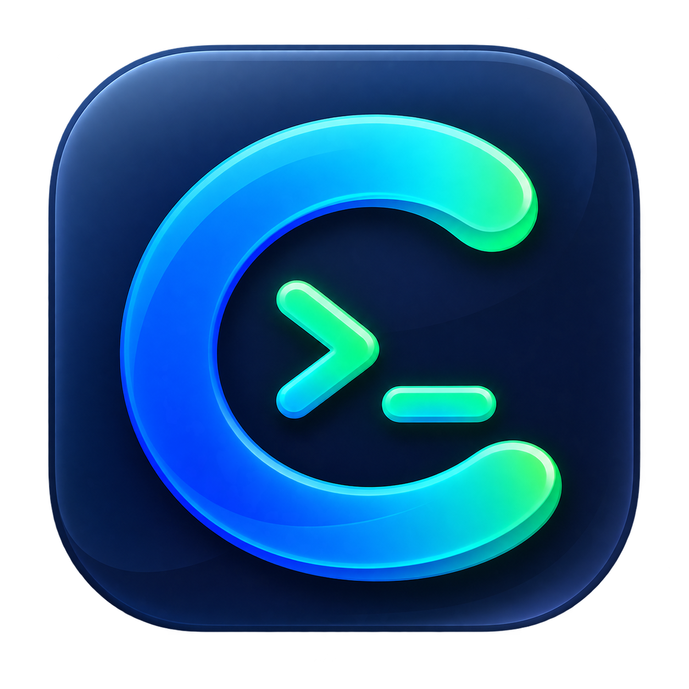

<p align="center">
  
</p>

<h1 align="center">Connex</h1>

<p align="center">
  一款专注于 SSH、远程终端与 SFTP 工作流的轻量桌面客户端。
  <br />
  在一个紧凑、清晰的工作区里完成连接、操作和文件传输。
</p>

<p align="center">
  <a href="https://github.com/gqh0128/Connex/actions/workflows/build-desktop.yml">
    
  </a>
  
  <a href="./LICENSE">
    
  </a>
  
</p>

> **开发状态**
>
> Connex 当前处于积极开发阶段。macOS ARM64 是主要验证平台；Windows x64 已接入自动构建，但仍在持续进行实机兼容性验证。Linux 暂未提供官方构建包。

## 为什么选择 Connex

Connex 希望把日常服务器操作中最常用的几件事放在同一个桌面工作区里，同时保持生产力工具应有的紧凑感：

- **终端与文件协同**：SSH 终端、远程文件和传输任务围绕同一会话展开，不需要在多个窗口之间切换。
- **可靠的传输队列**：上传和下载共享 FIFO 队列，支持文件与文件夹、并发限制、暂停继续、断点续传、自动重试以及单任务和全队列 ETA。
- **舒适的终端体验**：支持搜索、可点击链接、语义高亮、多会话标签、字体导入以及字号、字重、行距和配色调整。
- **本地优先的安全设计**：连接和设置保存在本机，凭据加密存储，主机指纹变化默认拒绝连接，不依赖云端同步。
- **克制的桌面界面**：提供明暗模式、多套全局配色与 75%–175% 界面缩放，强调紧凑、轻盈和稳定的布局。

## 已实现功能

### SSH 连接

- 新建、编辑、删除、搜索和分组管理连接
- 密码、私钥和 SSH Agent 认证
- 新建或编辑时测试连接，并展示完整错误信息
- 首次主机指纹确认与已知主机指纹变化保护
- 扫描、预览并批量导入 `~/.ssh/config`，支持冲突处理
- 使用加密的 `.connex-backup` 文件导入和导出连接配置

### 远程终端

- 基于 xterm.js 的交互式终端和多会话标签
- 终端内容搜索、大小写匹配和结果导航
- URL 识别与修饰键点击打开
- 对 URL、命令选项、路径、环境变量和 Shell 提示符进行语义高亮；远端 ANSI 颜色始终优先
- 七套常用字体预设、本机等宽字体检测和自定义字体文件导入
- 字体、字重、字号和行距实时预览与调整
- macOS 使用 `Command +/-`、Windows/Linux 使用 `Ctrl +/-` 调整终端字号

### SFTP 与文件传输

- 浏览远程目录，新建、重命名和删除远程文件或空目录
- Shift 连选、Command/Ctrl 多选和全选等桌面文件列表交互
- 上传和下载单个文件或完整文件夹，并保留目录层级与空目录
- 每次下载由系统原生对话框选择保存位置，不固定下载目录
- 统一传输队列、默认 3 路并发、进度、速度和 ETA
- 暂停、继续、断点续传、取消、自动重试和手动重试

### 外观与偏好

- 跟随系统、浅色和深色界面主题
- 松柏绿、商务蓝、石墨灰、深海青、沉稳靛和暖岩棕等全局配色
- 75%–175%、步长 5% 的全局界面缩放
- 可选的退出前确认，并将偏好持久化到本地数据库

## 平台状态

| 平台    | 架构                  | 状态                                          |
| ------- | --------------------- | --------------------------------------------- |
| macOS   | Apple Silicon / ARM64 | 主要开发与验证平台，GitHub Actions 自动构建   |
| Windows | x64                   | GitHub Actions 自动构建，实机兼容性持续验证中 |
| Linux   | —                     | 源码保留兼容设计，暂未提供官方构建包          |

推送与应用版本对应的 `v*` 标签时，GitHub Actions 会自动创建同名 Release，并上传 macOS ARM64 的 `.dmg` 以及 Windows x64 的 `.exe`、`.msi` 安装包。手动触发工作流时只生成 Actions Artifacts，便于发布前验证；当前尚未接入正式代码签名。

## 从源码运行

### 环境要求

- Node.js 20.19 或更高版本
- pnpm 11
- Rust stable
- 当前平台对应的 [Tauri 2 系统依赖](https://v2.tauri.app/start/prerequisites/)

### 开发模式

```bash
git clone https://github.com/gqh0128/Connex.git
cd Connex
pnpm install --frozen-lockfile
pnpm tauri dev
```

仅启动 Web 前端预览：

```bash
pnpm dev
```

Web 前端预览适合检查布局与主题；SSH、SFTP、本地文件选择和安全存储等能力需要在 Tauri 桌面进程中运行。

### 构建桌面应用

```bash
pnpm tauri build
```

构建产物位于 `src-tauri/target/release/bundle/`。不同平台的安装包应在对应平台或相应的 GitHub Actions runner 上构建。

## 质量检查

提交代码前至少运行：

```bash
pnpm format:check
pnpm check
pnpm build
```

- `pnpm format:check`：检查 Prettier 与 rustfmt 格式。
- `pnpm check`：执行 TypeScript 类型检查、ESLint 和 Clippy。
- `pnpm build`：再次检查 TypeScript 并生成前端生产构建。

涉及 Tauri 配置、Rust 依赖或桌面打包能力时，再运行：

```bash
pnpm tauri build --debug
```

## 技术架构

```text
React + TypeScript + xterm.js
            │
      typed Tauri IPC
            │
Tauri + Rust services/managers
     ├── russh / russh-sftp
     ├── SQLite
     ├── OS credential store
     └── local filesystem
```

- React 负责界面、交互状态和终端渲染。
- Rust 负责 SSH、SFTP、文件访问、持久化、安全凭据和长生命周期任务。
- 终端输出和传输进度通过有序 Channel 传递；文件内容不会经过 React 或 JSON。
- 前后端以类型化 Tauri commands 作为控制边界，业务组件不直接调用命令字符串。

主要技术栈：

- React 19、TypeScript、Vite 7
- Tauri 2、Rust 2024
- xterm.js 6
- russh、russh-sftp
- Tailwind CSS 4、shadcn/ui
- SQLite、AES-256-GCM、Argon2id

更完整的运行时与模块设计见 [docs/architecture.md](./docs/architecture.md)，界面规范见 [docs/ui-design-system.md](./docs/ui-design-system.md)。

## 安全设计

- 密码和私钥口令使用 AES-256-GCM 加密后存入 SQLite；随机本机主密钥保存在操作系统凭据管理器中。
- 未知主机需要用户确认；已保存主机指纹发生变化时默认拒绝连接。
- 私钥只保存路径，不会默认复制到应用数据库或连接备份中。
- SFTP 本地文件访问使用 Rust 签发的短生命周期 capability，前端不能为传输任务提交任意本地路径。
- 连接备份使用 Argon2id 派生临时密钥，并通过 AES-256-GCM 加密和校验完整性。
- 凭据、私钥内容和完整认证请求不得写入日志。

如果发现潜在安全问题，请不要在公开 Issue 中提交凭据、私钥、服务器地址或其他敏感信息。正式公开发布前，项目会补充独立的安全报告渠道和 `SECURITY.md`。

## 当前范围

Connex 第一阶段聚焦连接配置、SSH 认证、远程终端、多会话标签、SFTP 文件管理和传输队列。

以下能力暂不在当前范围内：

- 端口转发与 Jump Host
- Telnet、RDP、VNC 等其他协议
- 文件夹同步与远程编辑器
- 命令片段、多人协作和云同步

## 参与贡献

欢迎通过 Issue 报告可复现的问题或讨论功能建议，也欢迎提交 Pull Request。为了让变更容易审查：

1. 从最新 `dev` 开始开发，并将 Pull Request 目标分支设为 `dev`。
2. 每个提交只处理一个独立问题，提交信息使用 Conventional Commits。
3. 遵循 [AGENTS.md](./AGENTS.md) 中的架构、安全和代码约定。
4. 提交前运行完整的格式、静态检查和前端构建。
5. 涉及用户界面时，请附上修改前后的截图或录屏。

## 许可证

Connex 基于 [Apache License 2.0](./LICENSE) 开源。你可以自由使用、修改和分发本项目，也可以将其用于商业用途，但需要遵守许可证中的版权、许可证声明和变更说明要求。

仓库内置字体及其他第三方资源继续遵循各自目录中附带的许可证，不因 Connex 的项目许可证而改变。

---

<p align="center">
  Connex — 让远程服务器工作流保持简单、清晰和专注。
</p>
